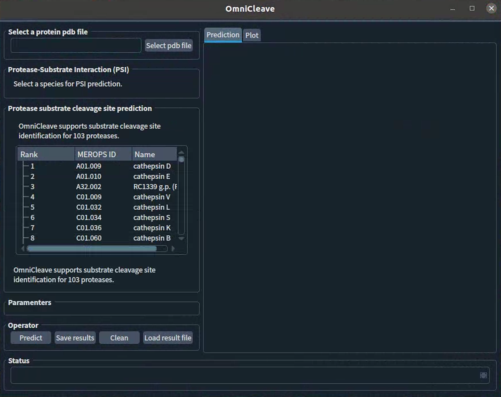
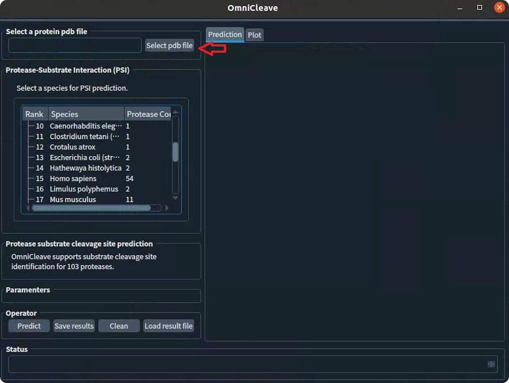
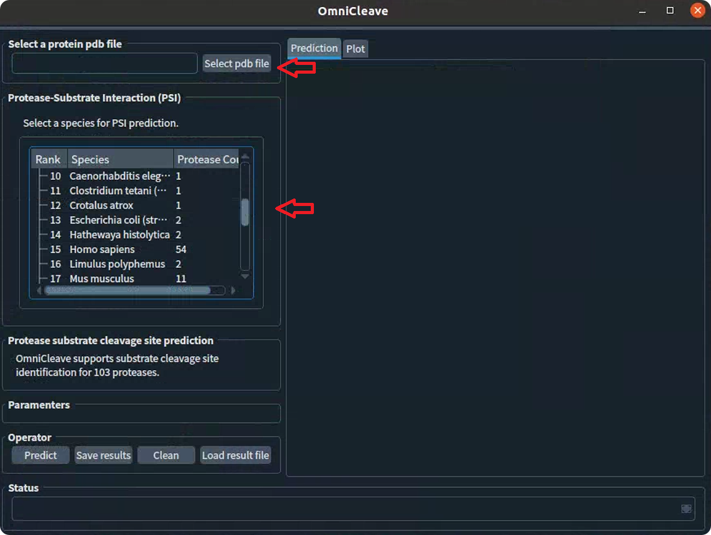
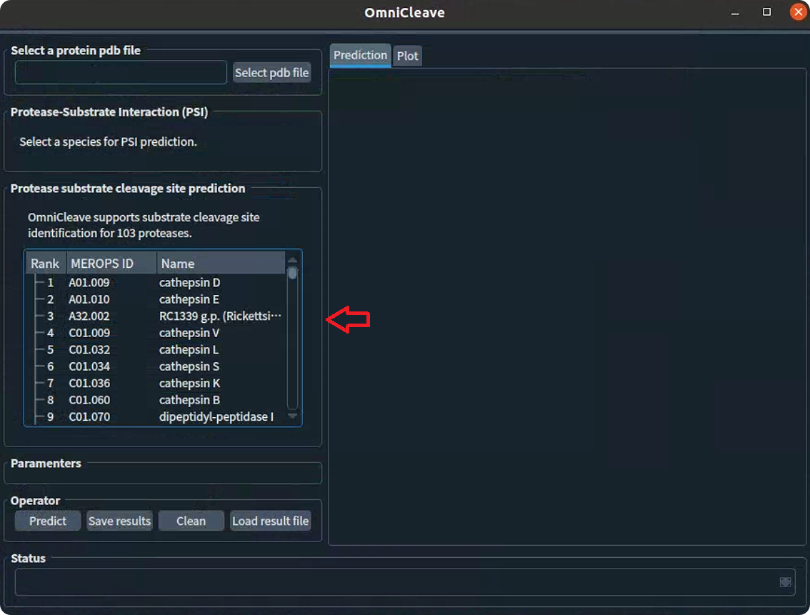
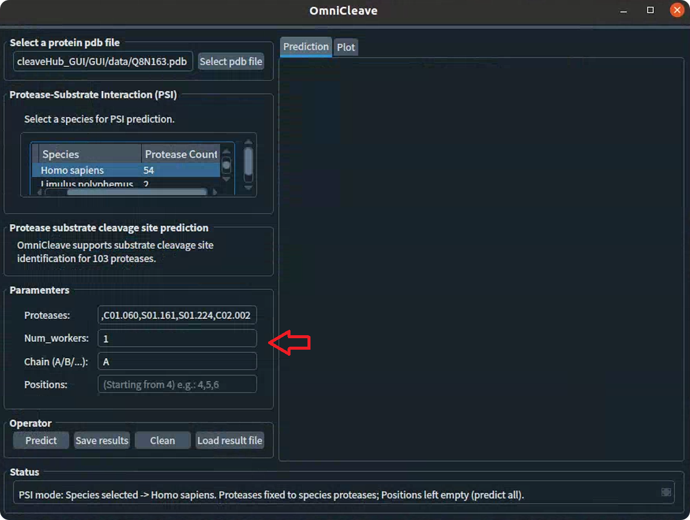
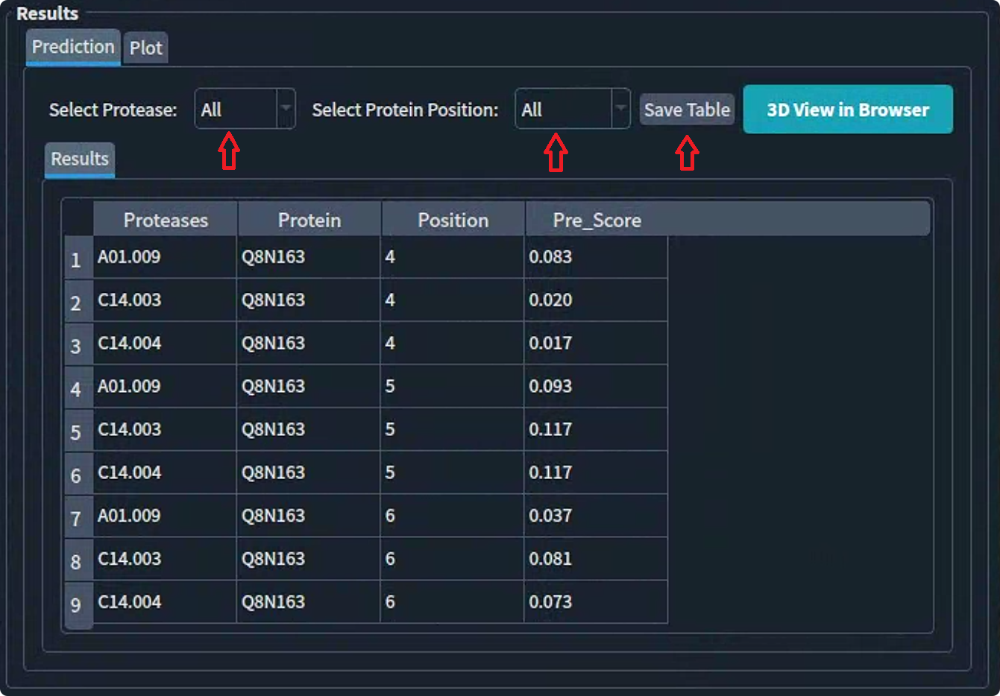
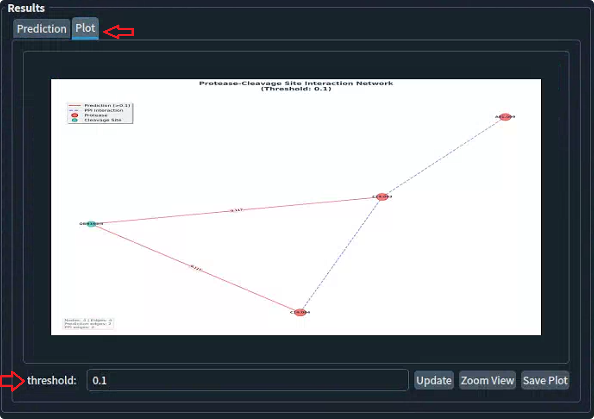
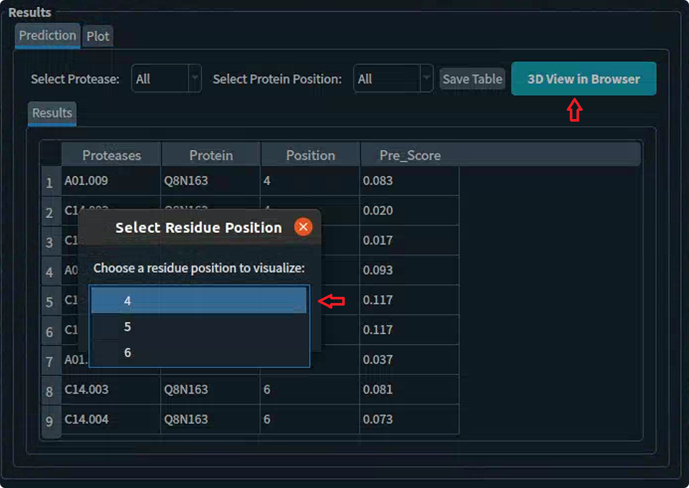
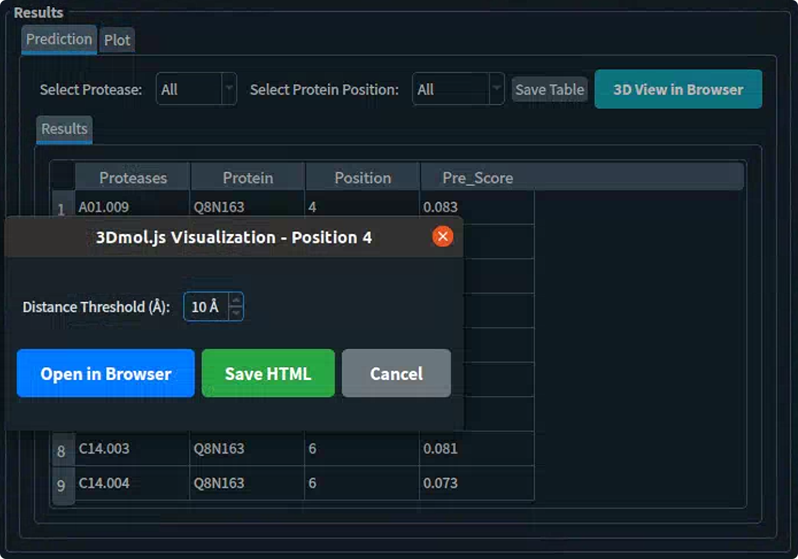
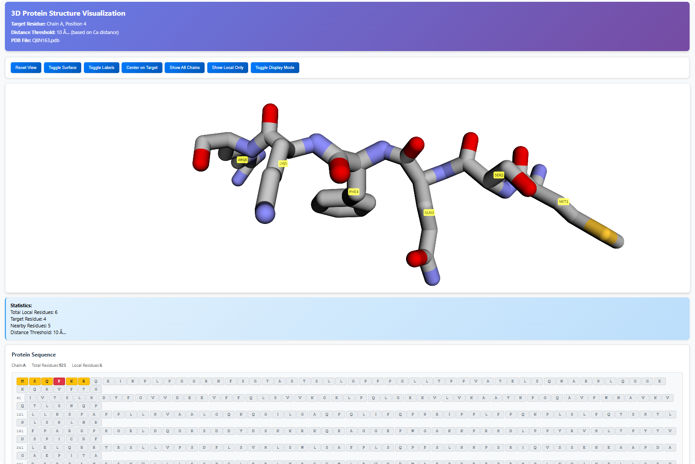

# OmniCleave

Protease–substrate interactions play central roles in regulating cellular processes, shaping disease mechanisms, and informing therapeutic development. Despite their importance, there remains a major gap in computational frameworks that can comprehensively interrogate protease–substrate interactions at scale. Existing tools are largely protease-specific, rely heavily on local sequence motifs, and fail to capture the structural context and inter-protease relationships that underlie protease biology. To bridge this gap, this study developed ***OmniCleave***, a structure-aware geometric deep learning framework for systematic in silico analysis of protease–substrate interactions. OmniCleave integrates multi-scale protein graph representations with protease–protease interaction networks, enabling systematic analysis of protease–substrate interactions within a single unified model. By integrating structural context and protease–protease interaction networks, OmniCleave not only accurately predicts protease–substrate interactions but also systematically learns the underlying protease–protease relationships and the structural preferences of substrate cleavage sites. Importantly, OmniCleave’s predictions were experimentally validated, including the identification of three novel caspase-3 substrates and cleavage sites. To further facilitate broad adoption, we provide both a GUI tool and a webserver, freely available at (http://omnicleave.biotools.bio/index.php/index).


## Table of Contents

- [Features](#features)
- [System Requirements](#system-requirements)
- [Installation Guide](#installation-guide)
  - [Environment Setup](#environment-setup)
  - [Dependency Installation](#dependency-installation)
  - [Data Preparation](#data-preparation)
- [User Guide](#user-guide)
  - [Command Line Usage](#command-line-usage)
  - [Starting the Platform](#starting-the-platform)
  - [Basic Workflow](#basic-workflow)
  - [Feature Details](#feature-details)
- [Results Description](#results-description)
- [Frequently Asked Questions](#frequently-asked-questions)
- [Technical Support](#technical-support)

## Features

- **Protease-substrate interaction**: Supports Protease-substrate interaction prediction
- **Multi-protease Support**: Supports cleavage site prediction for 103 proteases
- **Intuitive GUI Interface**: User-friendly graphical interface
- **Interactive Result Display**: Table filtering, network visualization, 3D structure analysis
- **Multiple Data Formats**: Supports PDB file input and CSV result export
- **3D Visualization**: Integrated 3Dmol protein structure visualization
- **Network Analysis**: Protease-cleavage site interaction network graphs

## System Requirements

- **Operating System**: MacOS 10.5+, Linux (Ubuntu 18.04+)
- **Python Version**: Python 3.8+
- **Memory**: 8GB or more recommended

## Installation Guide

### Environment Setup

1. Create conda environment (Refer to https://www.anaconda.com/docs/getting-started/anaconda/install#linux-installer):
```bash
conda create -n OmniCleave python=3.8
conda activate OmniCleave
```

2. Clone the project:
```bash
git clone https://github.com/ABILiLab/OmniCleave.git
cd OmniCleave
```

### Dependency Installation

Install required Python packages:

```bash
pip install -r requirements.txt
```

Install **pytorch-cluster**, **pytorch-scatter**,**pytorch-sparse**, and **pytorch-spline-conv**:

```bash
conda install pytorch-cluster -c pyg
conda install pytorch-scatter -c pyg
conda install pytorch-sparse -c pyg
conda install pytorch-spline-conv -c pyg
# Or install using wheel (https://pytorch-geometric.com/whl/).
```
Install pyrosetta (https://pypi.org/project/pyrosetta-installer/) (https://www.pyrosetta.org/downloads):
```bash
python -c 'import pyrosetta_installer; pyrosetta_installer.install_pyrosetta()' # or
conda install pyrosetta # or install with wheel
# https://graylab.jhu.edu/download/PyRosetta4/archive/release/
```
When the program is executed for the first time, the esm pre-trained model (esm2_t33_650M_UR50D) will be downloaded, which takes a long time. For related code, see **get_esmfea()** in **features.py**. 
Install esm (https://pypi.org/project/fair-esm/) (https://github.com/facebookresearch/esm):
```bash
pip install fair-esm # latest release, OR:
pip install git+https://github.com/facebookresearch/esm.git 
```

Main dependencies include:
- fair-esm: Dependency package for extracting esm-based features
- pyrosetta: Dependency package for extracting Rosetta-based features
- PyQt5: GUI framework
- pandas: Data processing
- numpy: Numerical computation
- matplotlib: Plotting
- networkx: Network analysis
- torch: Deep learning framework
- biopython: Bioinformatics tools
- torch_geometric: Graph neural networks
- transformers: Protein sequence modeling

### Data Preparation

1. **MEROPS Database**: Ensure `Gui_data/MEROPS_identifier_Name.csv` file exists
2. **Model Files**: Place trained models in the `models/` directory
3. **3Dmol.js**: Place 3Dmol.js files in the `static/js/` directory (optional)
4. **Merops identifier (proteases_str)** Merops id details will be found at (https://www.ebi.ac.uk/merops/cgi-bin/id_index?type=peptidase;action=A).
## User Guide

### Command Line Usage

OmniCleave also supports command line execution for batch processing and automated workflows.

#### Basic Command Line Syntax

```bash
python OmniCleave.py --inputpath <PDB_FILE> --outputpath <OUTPUT_DIR> --proteases_str <PROTEASES>
```

#### Command Line Arguments

| Argument | Type | Default | Description |
|----------|------|---------|-------------|
| `--inputpath` | str | `./data/example.pdb` | Path to the input PDB file |
| `--outputpath` | str | `./Results` | Path for output results |
| `--proteases_str` | str | `C14.003,M10.002` | Comma-separated list of protease MEROPS IDs |
| `--chain` | str | `A` | Protein chain ID (A, B, C, etc.) |
| `--mode` | str | `Human-protease` | Prediction mode: `Human-protease` or `Multi-protease` |
| `--pdb_path` | str | `./data` | Directory containing PDB files |
| `--inputType` | str | `pdb` | Input file type (currently only `pdb` supported) |
| `--poss` | str | `4,5,6,7` | Comma-separated residue positions to predict (4 ≤ pos ≤ sequence_length). Leave empty to predict all positions |
| `--num_workers` | int | 2 | Set number of parallel processing worker threads |
#### Important Notes

- **Position Range**: The `--poss` parameter should specify positions where 4 ≤ position ≤ sequence_length
- **Protease MEROPS IDs**: Use valid MEROPS identifiers (e.g., A01.009, C14.003, M10.002)
- **Mode Selection**: 
  - `Human-protease`: Uses human-specific protease model (54 proteases)
  - `Multi-protease`: Uses multi-protease model (103 proteases)
- **Empty Positions**: Set `--poss ""` to predict all possible positions in the sequence

#### Example Commands

**Basic prediction with default parameters:**
```bash
python OmniCleave.py --inputpath ./data/protein.pdb --outputpath ./results
```

**Multi-protease prediction with specific positions:**
```bash
python OmniCleave.py \
    --inputpath ./data/protein.pdb \
    --pdb_path ./data \
    --outputpath ./results \
    --mode Multi-protease \
    --proteases_str A01.009,A01.010,C14.003 \
    --poss 4,5,6,7,8,9 \
    --chain A
```

**Human protease prediction:**
```bash
python OmniCleave.py \
    --inputpath ./data/protein.pdb \
    --pdb_path ./data \
    --outputpath ./results \
    --mode Human-protease \
    --proteases_str C14.003,M10.002 \
    --poss 4,5,6,7
    --chain A
```

**Predict all positions with multiple proteases:**
```bash
python OmniCleave.py \
    --inputpath ./data/protein.pdb \
    --pdb_path ./data \
    --outputpath ./results \
    --mode Multi-protease \
    --proteases_str A01.009,A01.010,C14.003,M10.002,S01.001 \
    --poss "" \
    --chain A
```

**High-throughput batch processing:**
```bash
python OmniCleave.py \
    --inputpath ./data/batch_protein.pdb \
    --pdb_path ./data \
    --outputpath ./batch_results \
    --mode Multi-protease \
    --proteases_str A01.009,A01.010,C14.003,M10.002,S01.001,T01.001 \
    --poss 10,15,20,25,30,35,40,45,50 \
    --chain A
```

#### Output Files

The command line execution generates the following output files in the specified output directory:

- `result.csv`: Main prediction results with columns:
  - `Proteases`: Protease MEROPS ID
  - `Protein`: Protein name
  - `position`: Residue position
  - `Pre_Score`: Prediction score (0-1)
  - `Pre_label`: Binary prediction (0 or 1), threshold defaults to 0.5.

- `proteases_structure_data/`: Directory containing processed structure data
- `proteases_prottrans/`: Directory containing protein features

#### Batch Processing

For batch processing multiple PDB files, you can create scripts for different scenarios:

**1. Basic batch processing script:**
```bash
#!/bin/bash
# Basic batch processing script
for pdb_file in ./data/*.pdb; do
    filename=$(basename "$pdb_file" .pdb)
    echo "Processing $filename..."
    python OmniCleave.py \
        --inputpath "$pdb_file" \
        --pdb_path ./data \
        --outputpath "./results/$filename" \
        --mode Multi-protease \
        --proteases_str A01.009,A01.010,C14.003
done
```

**2. Advanced batch processing with error handling:**
```bash
#!/bin/bash
# Advanced batch processing with error handling and logging
LOG_FILE="batch_processing.log"
ERROR_FILE="batch_errors.log"

echo "Starting batch processing at $(date)" | tee -a $LOG_FILE

for pdb_file in ./data/*.pdb; do
    filename=$(basename "$pdb_file" .pdb)
    echo "Processing $filename..." | tee -a $LOG_FILE
    
    if python OmniCleave.py \
        --inputpath "$pdb_file" \
        --pdb_path ./data \
        --outputpath "./results/$filename" \
        --mode Multi-protease \
        --proteases_str A01.009,A01.010,C14.003,M10.002,S01.001 \
        --poss 10,15,20,25,30; then
        echo "Successfully processed $filename" | tee -a $LOG_FILE
    else
        echo "Error processing $filename" | tee -a $ERROR_FILE
    fi
done

echo "Batch processing completed at $(date)" | tee -a $LOG_FILE
```

**3. Python batch processing script:**
```python
#!/usr/bin/env python3
import os
import subprocess
import glob
from pathlib import Path

def batch_process_pdbs(input_dir, output_dir, proteases, mode="Multi-protease"):
    """Batch process PDB files using ProcleaveHub command line interface."""
    
    # Create output directory if it doesn't exist
    Path(output_dir).mkdir(parents=True, exist_ok=True)
    
    # Get all PDB files
    pdb_files = glob.glob(os.path.join(input_dir, "*.pdb"))
    
    if not pdb_files:
        print(f"No PDB files found in {input_dir}")
        return
    
    print(f"Found {len(pdb_files)} PDB files to process")
    
    for pdb_file in pdb_files:
        filename = os.path.splitext(os.path.basename(pdb_file))[0]
        output_path = os.path.join(output_dir, filename)
        
        print(f"Processing {filename}...")
        
        # Build command
        cmd = [
            "python", "OmniCleave.py",
            "--inputpath", pdb_file,
            "--pdb_path" input_dir,
            "--outputpath", output_path,
            "--mode", mode,
            "--proteases_str", proteases,
            "--poss", "10,15,20,25,30,35,40,45,50"
        ]
        
        try:
            # Run command
            result = subprocess.run(cmd, capture_output=True, text=True, check=True)
            print(f"Successfully processed {filename}")
        except subprocess.CalledProcessError as e:
            print(f"Error processing {filename}: {e.stderr}")
        except Exception as e:
            print(f"Unexpected error processing {filename}: {e}")

if __name__ == "__main__":
    # Configuration
    input_directory = "./data"
    output_directory = "./batch_results"
    protease_list = "A01.009,A01.010,C14.003,M10.002,S01.001,T01.001"
    
    # Run batch processing
    batch_process_pdbs(input_directory, output_directory, protease_list)
```

#### Command Line vs GUI Comparison

| Feature | Command Line | GUI Platform |
|---------|-------------|--------------|
| **Batch Processing** | ✅ Full support | ❌ Single file only |
| **Automation** | ✅ Scriptable | ❌ Manual operation |
| **High-throughput** | ✅ Parallel processing | ❌ Sequential only |
| **Interactive Visualization** | ❌ No visualization | ✅ Rich visualization |
| **Real-time Parameter Validation** | ❌ Basic validation | ✅ Smart validation |
| **3D Structure View** | ❌ No 3D view | ✅ 3Dmol integration |
| **Network Analysis** | ❌ No network analysis | ✅ Interactive networks |
| **Easy Parameter Tuning** | ❌ Manual editing | ✅ Interactive controls |
| **Result Filtering** | ❌ No filtering | ✅ Dynamic filtering |
| **Learning Curve** | ⚠️ Requires CLI knowledge | ✅ User-friendly |
| **Resource Usage** | ✅ Lower memory | ⚠️ Higher memory |
| **Debugging** | ✅ Full error output | ⚠️ Limited error info |

#### Troubleshooting Command Line Issues

**Common Issues and Solutions:**

1. **"No module named 'torch'" error:**
   ```bash
   # Install PyTorch
   pip install torch torchvision torchaudio
   # Or with CUDA support
   pip install torch torchvision torchaudio
   ```

2. **"File not found" error:**
   ```bash
   # Check if PDB file exists and path is correct
   ls -la ./data/your_file.pdb
   # Use absolute path if needed
   python OmniCleave.py --inputpath /absolute/path/to/file.pdb --pdb_path /absolute/path/to
   ```

3. **"Invalid protease ID" error:**
   ```bash
   # Check valid MEROPS IDs in the GUI_data/MEROPS identifier_Name.csv file
   head -10 Gui_data/MEROPS_identifier_Name.csv
   ```

4. **Memory issues with large proteins:**
   ```bash
   # Process specific positions instead of all positions
   python OmniCleave.py --poss "10,20,30,40,50" --inputpath large_protein.pdb ...
   ```

5. **CUDA out of memory:**
   ```bash
   # The model will automatically fall back to CPU if CUDA is not available
   # For large proteins, consider using specific positions only
   python OmniCleave.py --poss "5,10,15,20" --inputpath protein.pdb ...
   ```

### Starting the Platform

```bash
cd OmniCleave
conda activate OmniCleave
python OmniCleave_GUI.py
```

### Basic Workflow

#### 1. Input Data
- Click "select pdb file" button to choose a PDB file
- The system will automatically validate file format and integrity



#### 2. Select Proteases or Species
- Choose one or more proteases from the protease list (For Cleave site prediction); Choose one specie from the species list (For Protease-Substrate interaction prediction)
- Supports multiple selection, separated by commas
- Click on proteases in the list to quickly add/remove



#### 3. Set Parameters
- **Chain**: Specify protein chain ID (e.g., A, B, C)
- **Num_workers**: Set number of parallel processing worker threads
- **Positions**: Specify residue positions to predict (optional, leave empty to predict all positions)



#### 4. Run Prediction
- Click "Predict" button to start prediction
- The system will display prediction progress and status information
- Results will be automatically displayed after prediction completion

### Feature Details

#### Results Table
- **Filtering Function**: Filter results by protease or protein position
- **Sorting Function**: Support sorting by prediction score
- **Export Function**: Support CSV, Excel, TSV format export



#### Network Visualization 
- Click the "Plot" button to display the protease cleavage site interactions based on the current table contents.
- **Interactive Network Graph**: Display protease-cleavage site interactions
- **Threshold Adjustment**: Adjustable display threshold
- **Multiple Views**: Support zoom, save, interactive browsing


#### 3D Structure Analysis
- **3Dmol.js Integration**: Display 3D structure in browser
- **Local Residue Highlighting**: Highlight target residues and their neighboring regions
- **Interactive Operations**: Support rotation, zoom, label toggling



## Results Description

### Prediction Result Format

Prediction results contain the following columns:
- **Proteases**: Protease name
- **Protein**: Protein name
- **Position**: Residue position
- **Pre_Score**: Prediction score (0-1, higher values indicate greater cleavage probability)

### Network Graph Description

- **Red solid lines**: Prediction edges (prediction score > threshold)
- **Blue dashed lines**: PPI interaction edges
- **Red nodes**: Proteases
- **Cyan nodes**: Cleavage sites

### 3D Visualization Description

- **Target residue**: Highlighted in red
- **Local residues**: Displayed in yellow (within distance threshold)
- **Other residues**: Displayed in gray
- **CPK color scheme**: Standard atomic color coding

## Frequently Asked Questions

### Q: What to do if prediction takes too long?
A: You can try the following methods:
- Reduce the number of residue positions to predict
- Increase the number of worker threads
- Use more powerful hardware configuration

### Q: 3D visualization not displaying?
A: Check the following items:
- Ensure PDB file format is correct
- Check if 3Dmol.js files exist
- Try using different browsers

### Q: How to improve prediction accuracy?
A: Recommendations:
- Use high-quality PDB structure files
- Ensure protein structure is complete
- Choose appropriate protease combinations

### Q: What file formats are supported?
A: Currently supports:
- Input: PDB format (.pdb, .ent)
- Output: CSV, Excel, TSV formats

## Technical Support

If you encounter problems during use, please:

1. Check the FAQ section of this documentation
2. Check system logs and error messages
3. Contact the technical support team

---

**Note**: This platform is for research use only. Prediction results are for reference only and cannot replace experimental validation.

